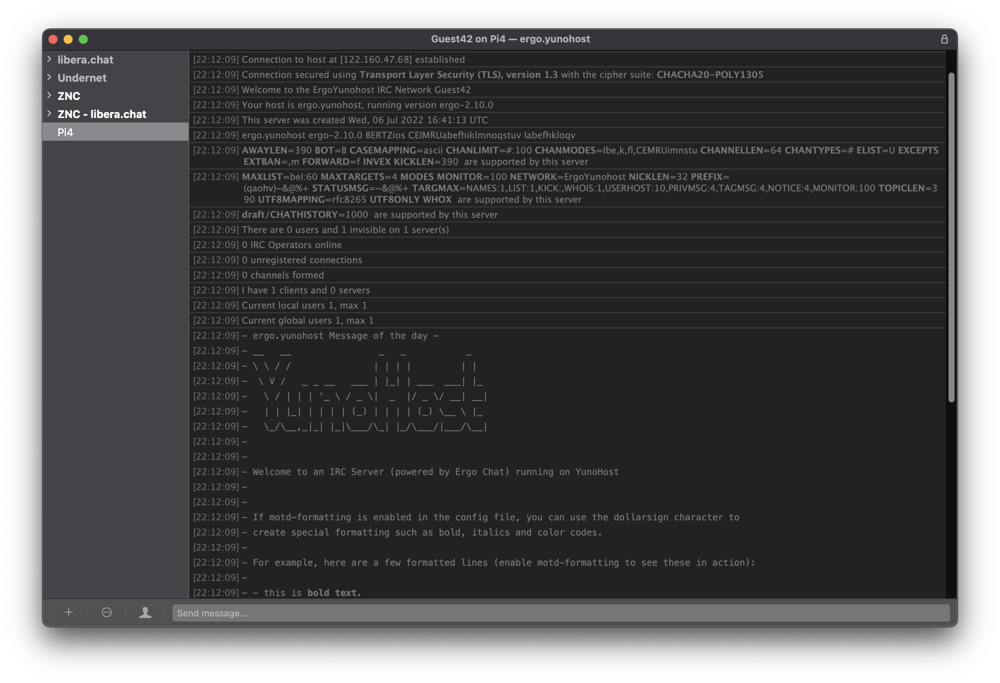

<!--
N.B.: This README was automatically generated by https://github.com/YunoHost/apps/tree/master/tools/README-generator
It shall NOT be edited by hand.
-->

# Ergo for YunoHost

[](https://dash.yunohost.org/appci/app/ergo)    
[](https://install-app.yunohost.org/?app=ergo)

*[Lire ce readme en français.](./README_fr.md)*

> *This package allows you to install Ergo quickly and simply on a YunoHost server.
If you don't have YunoHost, please consult [the guide](https://yunohost.org/#/install) to learn how to install it.*

## Overview

Ergo (formerly known as Oragono) is a modern IRC server written in Go. Its core design 

### Features

- Being simple to set up and use
- Combining the features of an ircd, a services framework, and a bouncer (integrated account management, history storage, and bouncer functionality)
- Bleeding-edge IRCv3 support, suitable for use as an IRCv3 reference implementation
- High customizability via a rehashable (i.e., reloadable at runtime) YAML config


**Shipped version:** 2.9.1~ynh1

**Demo:** https://testnet.ergo.chat/

## Screenshots



## Disclaimers / important information

* Any known limitations, constrains or stuff not working, such as (but not limited to):
    * requiring a full dedicated domain ?
    * architectures not supported ?
    * not-working single-sign on or LDAP integration ?
    * the app requires an important amount of RAM / disk / .. to install or to work properly
    * etc...

* Other infos that people should be aware of, such as:
    * any specific step to perform after installing (such as manually finishing the install, specific admin credentials, ...)
    * how to configure / administrate the application if it ain't obvious
    * upgrade process / specificities / things to be aware of ?
    * security considerations ?

## Documentation and resources

* Official app website: <https://ergo.chat/>
* Official user documentation: <https://github.com/ergochat/ergo/blob/stable/docs/USERGUIDE.md>
* Official admin documentation: <https://github.com/ergochat/ergo/blob/stable/docs/MANUAL.md>
* Upstream app code repository: <https://github.com/ergochat/ergo>
* YunoHost documentation for this app: <https://yunohost.org/app_ergo>
* Report a bug: <https://github.com/YunoHost-Apps/ergo_ynh/issues>

## Developer info

Please send your pull request to the [testing branch](https://github.com/YunoHost-Apps/ergo_ynh/tree/testing).

To try the testing branch, please proceed like that.

``` bash
sudo yunohost app install https://github.com/YunoHost-Apps/ergo_ynh/tree/testing --debug
or
sudo yunohost app upgrade ergo -u https://github.com/YunoHost-Apps/ergo_ynh/tree/testing --debug
```

**More info regarding app packaging:** <https://yunohost.org/packaging_apps>
