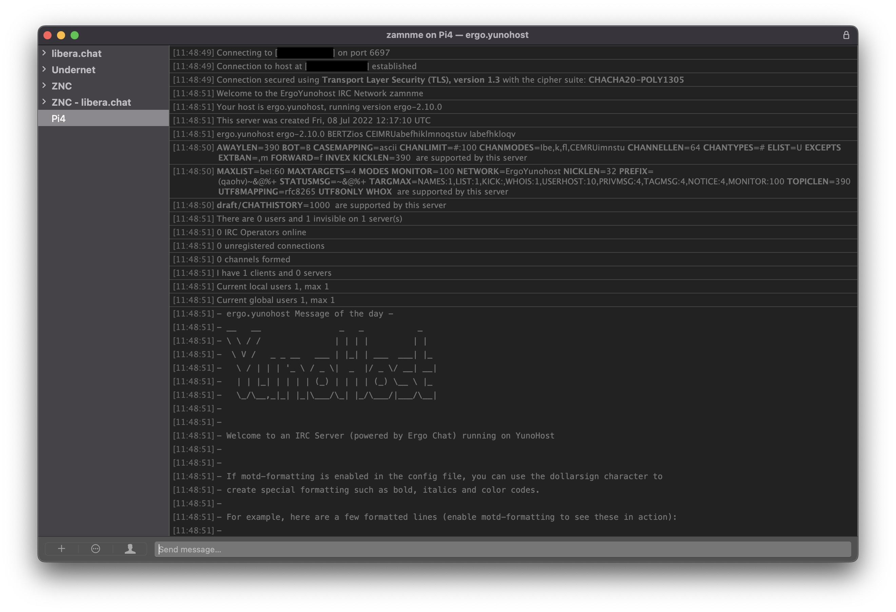

<!--
N.B.: README ini dibuat secara otomatis oleh <https://github.com/YunoHost/apps/tree/master/tools/readme_generator>
Ini TIDAK boleh diedit dengan tangan.
-->

# Ergo untuk YunoHost

[](https://ci-apps.yunohost.org/ci/apps/ergo/)


[](https://install-app.yunohost.org/?app=ergo)

*[Baca README ini dengan bahasa yang lain.](./ALL_README.md)*

> *Paket ini memperbolehkan Anda untuk memasang Ergo secara cepat dan mudah pada server YunoHost.*  
> *Bila Anda tidak mempunyai YunoHost, silakan berkonsultasi dengan [panduan](https://yunohost.org/install) untuk mempelajari bagaimana untuk memasangnya.*

## Ringkasan

Ergo is a modern IRC server written in Go. Its core design 

### Features

- Being simple to set up and use
- Combining the features of an ircd, a services framework, and a bouncer (integrated account management, history storage, and bouncer functionality)
- Bleeding-edge IRCv3 support, suitable for use as an IRCv3 reference implementation
- High customizability via a rehashable (i.e., reloadable at runtime) YAML config


**Versi terkirim:** 2.14.0~ynh1

**Demo:** <https://testnet.ergo.chat/>

## Tangkapan Layar



## Dokumentasi dan sumber daya

- Website aplikasi resmi: <https://ergo.chat/>
- Dokumentasi pengguna resmi: <https://github.com/ergochat/ergo/blob/stable/docs/USERGUIDE.md>
- Dokumentasi admin resmi: <https://github.com/ergochat/ergo/blob/stable/docs/MANUAL.md>
- Depot kode aplikasi hulu: <https://github.com/ergochat/ergo>
- Gudang YunoHost: <https://apps.yunohost.org/app/ergo>
- Laporkan bug: <https://github.com/YunoHost-Apps/ergo_ynh/issues>

## Info developer

Silakan kirim pull request ke [`testing` branch](https://github.com/YunoHost-Apps/ergo_ynh/tree/testing).

Untuk mencoba branch `testing`, silakan dilanjutkan seperti:

```bash
sudo yunohost app install https://github.com/YunoHost-Apps/ergo_ynh/tree/testing --debug
atau
sudo yunohost app upgrade ergo -u https://github.com/YunoHost-Apps/ergo_ynh/tree/testing --debug
```

**Info lebih lanjut mengenai pemaketan aplikasi:** <https://yunohost.org/packaging_apps>
